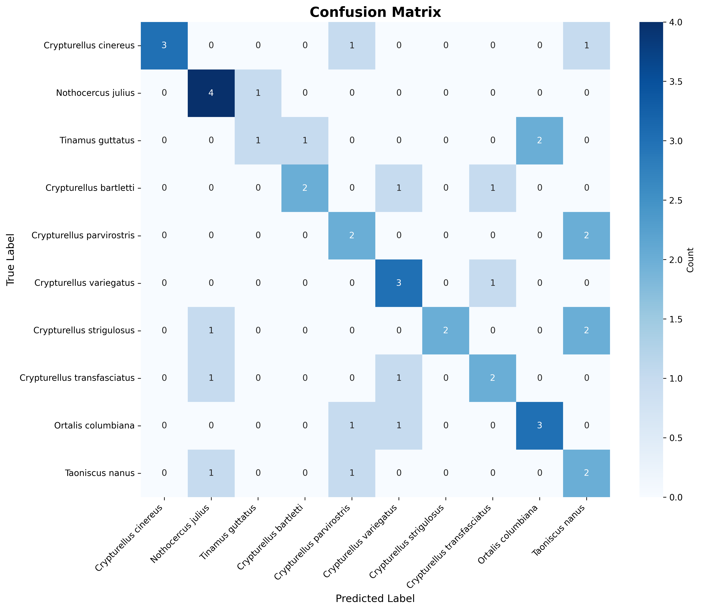
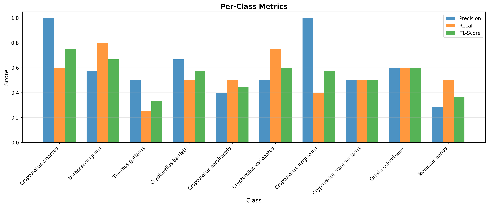

# Evaluation Report

## Overall Metrics

| Metric | Value |
|--------|-------|
| Accuracy | 0.5455 |
| Macro F1 | 0.5401 |
| Weighted F1 | 0.5498 |

## Per-Class Metrics

| Class | Precision | Recall | F1-Score | Support |
|-------|-----------|--------|----------|----------|
| Crypturellus cinereus | 1.0000 | 0.6000 | 0.7500 | 5 |
| Nothocercus julius | 0.5714 | 0.8000 | 0.6667 | 5 |
| Tinamus guttatus | 0.5000 | 0.2500 | 0.3333 | 4 |
| Crypturellus bartletti | 0.6667 | 0.5000 | 0.5714 | 4 |
| Crypturellus parvirostris | 0.4000 | 0.5000 | 0.4444 | 4 |
| Crypturellus variegatus | 0.5000 | 0.7500 | 0.6000 | 4 |
| Crypturellus strigulosus | 1.0000 | 0.4000 | 0.5714 | 5 |
| Crypturellus transfasciatus | 0.5000 | 0.5000 | 0.5000 | 4 |
| Ortalis columbiana | 0.6000 | 0.6000 | 0.6000 | 5 |
| Taoniscus nanus | 0.2857 | 0.5000 | 0.3636 | 4 |

## Top Misclassifications

1. Tinamus guttatus → Ortalis columbiana (2 times)
2. Crypturellus parvirostris → Taoniscus nanus (2 times)
3. Crypturellus strigulosus → Taoniscus nanus (2 times)
4. Crypturellus cinereus → Crypturellus parvirostris (1 times)
5. Crypturellus cinereus → Taoniscus nanus (1 times)

## Confusion Matrix

## Per-Class Metrics Visualization

